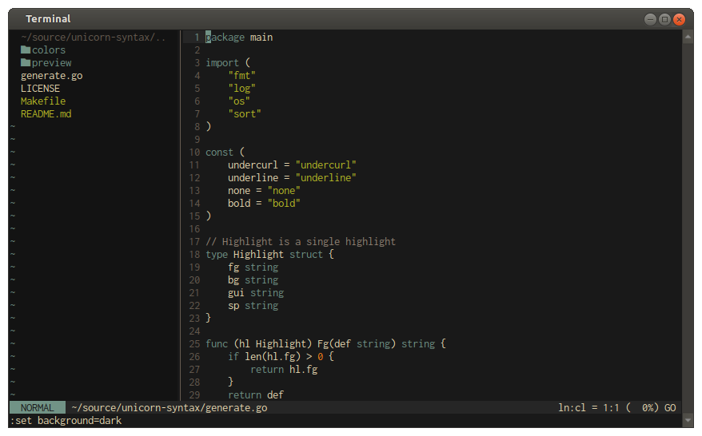
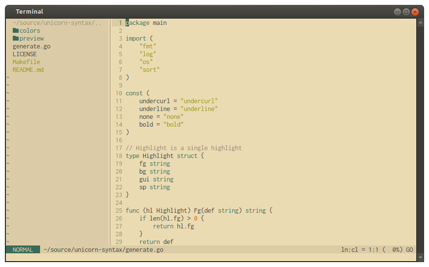

# Unicorn Theme

A color scheme I like and created (inspired by many others).  
Simple and does not have to have a different color for each different token type.

Theme for (neo)vim included.  
This is currently only for personal use and better highlighting for a language if I need it (Some things will work out of the box but I optimized it for some languages).

When editing and regenerating use `generate.go` and run `make` with `go` language installed.

For usage in another context all colors are saved centrally in `colors.env`.




## Usage
```vim
" Include with plugin manager (e.g. vim-plug)
Plug "mbndr/unicorn-syntax"

" ...

" Light theme also available
set background=dark
colorscheme unicorn
```
