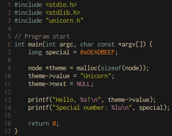
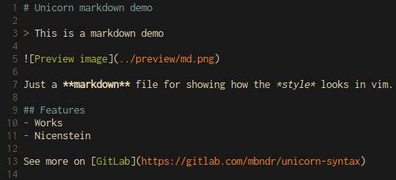
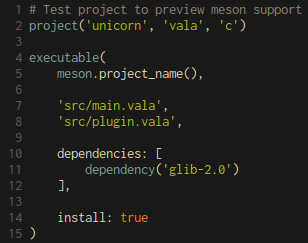

# Unicorn Theme

A color scheme I like and created (inspired by many others).  
Simple and does not have to have a different color for each different token type.

Theme for (neo)vim included.  
This is currently only for personal use and better highlighting for a language if I need it (Some things will work out of the box but I optimized it for some languages).

## C

## Markdown

## Meson

